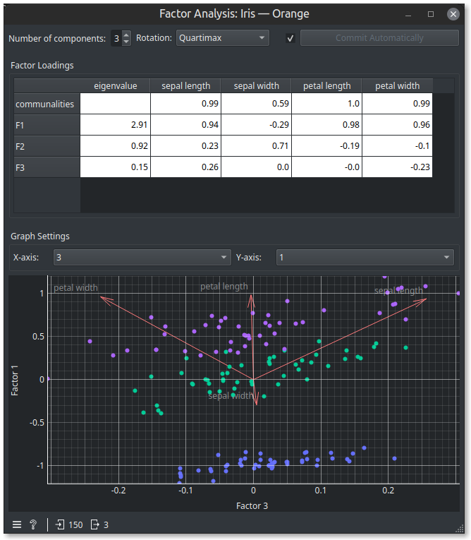

# Orange3-FactorAnalysis

This widgets performs Factor Analysis on the input table and displays it in a visualization.

Here is an example workflow using the iris dataset.

## Installation

1. In the main Orange canvas toolbar menu, select Options, _A_ddons....
2. Within the Add-ons installer, click on "Add more..." and type in orange3-factoranalysis

## Credits

A huge amount of the code for this widget came from *suriikata*'s [Orange-FA-widget](https://github.com/suriikata/Orange-FA-widget).

> Najlepša hvala za ta čudovit začetek z Orange pripomočkom za faktorsko analizo.